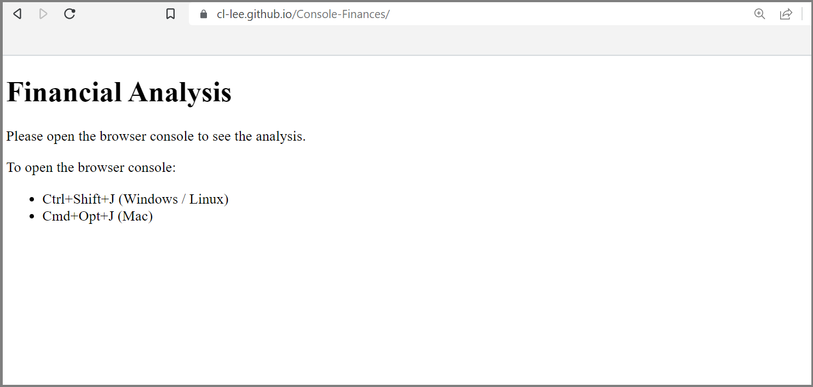
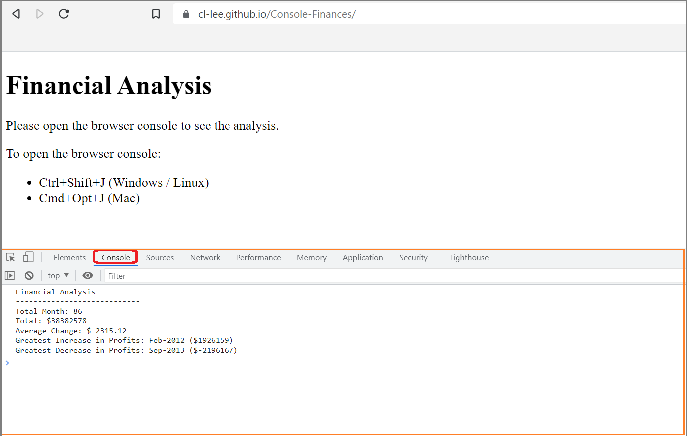

# Console - Financial Analysis

## Description 
Welcome to my Console Finances repo! The aim of this project is to analyse the financial records of a company using JavaScript.

- For this project, the analysis will cover the *monthly profits/losses* data from Jan 2010 to Feb 2017 of a company. The dataset can be found in the JavaScript file.

- The analysis shall provide the following results:
    1. The **total number of months** in the dataset
    2. The **net total profit and losses** over the period of time
    3. The **average of changes in profit and losses** over the period of time
    4. The **greatest increase in profits** during the period of time
    5. The **greatest decrease in profits** during the period of time

## Prerequisites
A web browser is required to access this project. The results will be displayed in the browser's console.

## Usage
* Please visit the following URL to visit access the project webpage:
https://cl-lee.github.io/Console-Finances/  
  

* After opening the webpage, please open the browser console* to see the analysis results. The console can be found in browser's developer tools.

    **Below are some keyboard shortcuts to access the browser console!*
    * Ctrl+Shift+J (Windows / Linux)
    * Cmd+Opt+J (Mac)
    